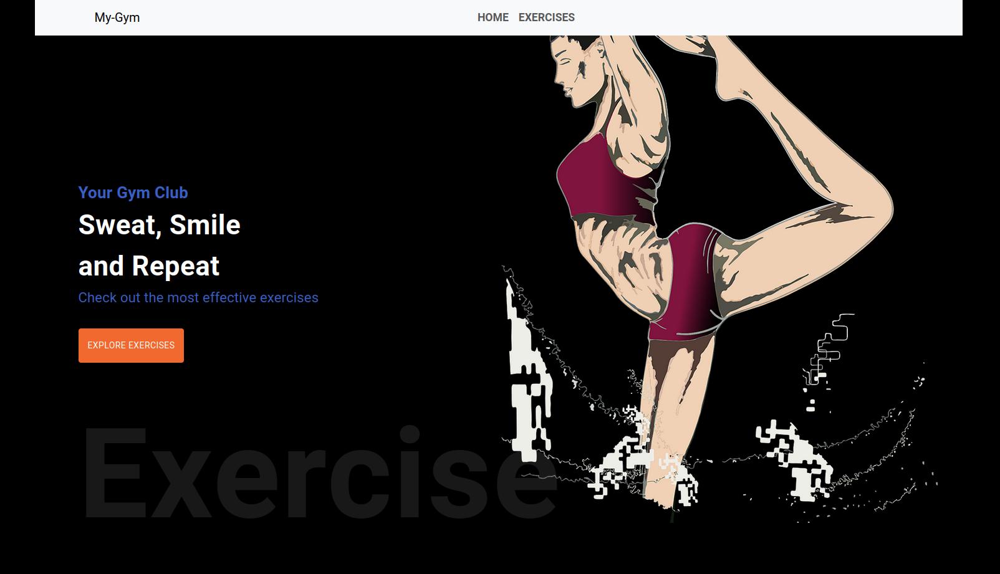

# GYM APP 

## Overview

**Gym-App** is a simple web application developed as a template to assist in workout planning. It utilizes external APIs to provide an interactive experience for users, allowing them to search for and view exercises categorized by muscle group, watch YouTube videos with instructions on how to perform exercises correctly, and see GIF images illustrating how the exercises are performed.

### Key Features:

- **Exercise Search**: Users can search for exercises based on the muscle group category (e.g., chest, legs, back, etc.).
- **Instructional Videos**: Using the YouTube API, users can watch videos that demonstrate how to correctly perform the exercise.
- **GIF Images**: Each exercise includes a GIF showing how to execute it, with the highlighted muscle group being worked.
- **Flexible Template**: This app serves as a simple template for any application that needs to integrate exercise and video APIs.

## Technologies

This project uses the following technologies:

- **React**: JavaScript library for building the user interface.
- **React-Bootstrap**: A responsive, styled component library based on Bootstrap.
- **RapidAPI**: A service to fetch exercise information, including muscle groups and GIFs.
- **YouTube API**: For searching YouTube videos that explain how to perform the exercises.

## How to Run the Project

### Prerequisites

- Node.js and npm (or yarn) installed.
- A **RapidAPI** account to access the exercise API.

### Steps to Run

1. Clone the repository:

    git clone https://github.com/YOUR-USER/Gym-App.git
    cd Gym-App

2. Install the dependencies:

    npm install

3. Create a .env file in the root of the project and add your RapidAPI URL and API key (instructions on how to obtain the key can be found in the RapidAPI documentation):
    
    REACT_APP_RAPIDAPI_KEY=<YOUR_RAPIDAPI_KEY>

**How to obtain an API key:**

    Visit RapidAPI.
    Find the exercise API you want to use (e.g., ExerciseDB).
    Sign up and generate your API key.
    
4. After configuring the .env file, start the development server:

    npm start

    The app will be available at http://localhost:3000.

# API Functionality

**Exercise API (RapidAPI)**

The exercise API provides a list of exercises categorized by muscle group (e.g., chest, legs, back). For each exercise, the API returns:

    Name of the exercise.
    Category of the exercise (muscle group).
    A GIF illustrating the exercise.
    Details on which body part is primarily worked during the exercise.

# YouTube API

The YouTube API is used to search for instructional videos on how to perform exercises. When a user searches for an exercise, the API returns related videos that can be watched directly in the app.

# Main Components

    Navbar: Navigation bar containing links to main pages.
    Exercises: Displays a list of exercises based on user search.
    ExerciseCard: Individual component for each exercise, showing the name, GIF, and muscle group worked.
    Detail: Displays details of the exercise, including the YouTube video.

# Final Thoughts

    Project Expansion: This project can be expanded with additional features such as user login, exercise history, favorites, etc.
    UI Customization: While it’s a simple template, feel free to customize the design with your own preferences, using Bootstrap or your own styles. 

# Contributing

Contributions are welcome! If you have suggestions for improvements, bug fixes, or new features, feel free to open an issue or submit a pull request.